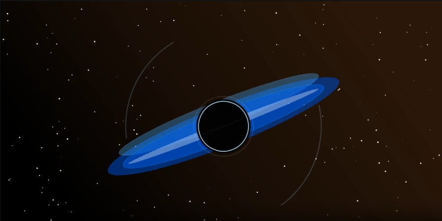

# ManimLite

Lightweight **motion graphics** for explainers and teaching clips: **Typst** math → SVG, **Skia** rasterization, **PyAV** MP4 export, optional **[Kitten TTS](https://github.com/KittenML/KittenTTS)** narration. Scene APIs favor explicit timelines and small composable primitives— approachable for humans and for LLM-assisted authoring.




Install and import as **`manimlite`** (`pip install -e ".[dev]"` from this repo).

| Goal | Target |
|------|--------|
| Cold render | Fast path vs typical LaTeX-disk + subprocess-encode pipelines |
| Install size | ~80 MB core (`[tts]` optional: upstream Kitten stack + HF models, much larger) |
| Math | Typst → SVG (no TeX Live) |
| Render | Skia (no Cairo) |
| Encode | PyAV in-memory (no per-frame disk + FFmpeg subprocess) |
| Voice-over | [Kitten TTS](https://github.com/KittenML/KittenTTS) local TTS, Apache-2.0 (optional `[tts]` extra) |

Installing `[tts]` may pull a **large** dependency tree (for example **PyTorch** and friends) as required by upstream **kittentts** 0.8.x — keep it optional. Core animation deps stay separate.

**Status:** pre-alpha — core rendering pipeline (Skia + Typst + PyAV) is functional; see [docs/](docs/) for requirements and design.

**Tutorial:** step-by-step build from ASCII to PyAV-oriented design in [learn/](learn/) (phases `000`–`100`).

## Demo

Short reel rendered from [`examples/showcase_intro.py`](examples/showcase_intro.py) (720p). The same file is committed as [`docs/assets/readme-demo.mp4`](docs/assets/readme-demo.mp4) so it shows up on GitHub without relying on external hosting.

<video src="docs/assets/readme-demo.mp4" controls muted playsinline width="100%"></video>

Regenerate locally:

```bash
manimlite render examples/showcase_intro.py -o docs/assets/readme-demo.mp4
```

Running `python examples/showcase_intro.py` writes `showcase_intro.mp4` in the current working directory; move or rename it if you are refreshing the committed demo.

If the preview does not load (some viewers block autoplay), open [`docs/assets/readme-demo.mp4`](docs/assets/readme-demo.mp4) directly.

## Quick start

```bash
# Install (requires Python 3.11+)
uv pip install -e ".[dev]"

# Install Typst CLI for math rendering
curl -fsSL https://github.com/typst/typst/releases/latest/download/typst-x86_64-unknown-linux-musl.tar.xz \
  | tar -xJ --strip-components=1 -C ~/.local/bin/

# Polished 720p showcase (recommended)
manimlite render examples/showcase_intro.py -o showcase.mp4

# Full-stack demo (text + math + code + circle)
manimlite render examples/math_and_text.py -o output.mp4

# Or run directly
python examples/showcase_intro.py
python examples/math_and_text.py
```

See the [Setup Guide](docs/guides/setup.md) for platform-specific instructions.

## Principles gallery

Twelve **drawing** and twelve **animation** principle demos live under [`examples/principles/`](examples/principles/). Each script writes an MP4 next to itself (those outputs stay gitignored).

```bash
python examples/principles/04_value.py
```

Index and topics: [Principles examples guide](docs/guides/principles-examples.md).

## Documentation

- [Setup Guide](docs/guides/setup.md) — installing skia-python and Typst
- [Math Rendering Guide](docs/guides/math-rendering.md) — using Typst for math
- [Principles examples](docs/guides/principles-examples.md) — `examples/principles/` gallery
- [Learn path (phases 000–100)](learn/README.md)
- [Proposal](docs/proposal.md)
- [Roadmap](docs/roadmap.md)
- [Software Requirements Specification (SRS)](docs/requirements/SRS.md)
- [Software Design Document (SDD)](docs/design/SDD.md)
- [Architecture](docs/design/architecture.md)
- [Public API sketch](docs/design/api-spec.md)

## License

MIT — see [LICENSE](LICENSE).

## Author

Nabin Oli
