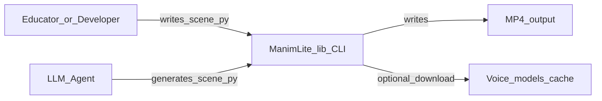
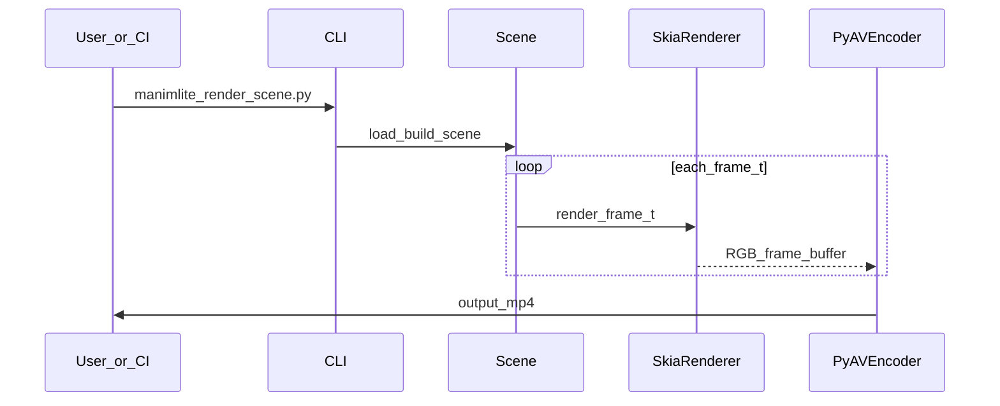
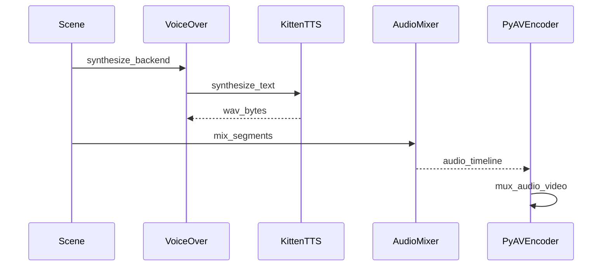

# Software Design Document (SDD)

**Project:** ManimLite  
**Style:** Arc42-inspired (adapted)  
**Version:** 0.1  
**Status:** Draft  

---

## 1. Introduction and goals

### 1.1 Requirements

See [SRS.md](../requirements/SRS.md).

### 1.2 Quality goals (priority order)

1. **Small install** — avoid TeX Live and heavy native stacks in core.
2. **Fast cold path** — minimize subprocesses and disk I/O in the render hot loop.
3. **LLM-friendly API** — explicit, typed, shallow object model.
4. **Feature breadth** — deliberately secondary to the above until core is solid.

---

## 2. Constraints

- Python **3.11+**
- MIT project; optional **Kitten TTS** (Apache-2.0) isolated as `[tts]` extra for install size and HF downloads
- Linux-first; macOS next

---

## 3. Context and scope (C4 Level 1)

**Scope boundary:** ManimLite does not host video, manage courses, or edit slide decks.

---

## 4. Solution strategy

- **Skia** for 2D rasterization (ADR-0001)
- **Typst→SVG** for math (ADR-0002)
- **PyAV** for encode/mux (ADR-0003)
- **Kitten TTS** for optional local TTS (ADR-0004)
- **Flat dataclasses** for public API (ADR-0005)

---

## 5. Building block view (logical modules)

| Module / package | Responsibility |
| ---------------- | ---------------- |
| `manimlite.core` | `Scene`, `Node`, `Timeline`, `Drawable` protocol |
| `manimlite.shapes` | Vector primitives |
| `manimlite.text` | Text, math, code |
| `manimlite.animate` | `Animation`, `Animator` |
| `manimlite.easing` | Scalar easing curves |
| `manimlite.render` | Skia frame renderer |
| `manimlite.export` | PyAV encoder/muxer |
| `manimlite.audio` | pydub mixer, Kitten TTS voice-over backend |
| `manimlite.cli` | Typer CLI |

---

## 6. Runtime view

### 6.1 Frame render and encode

### 6.2 Voice-over path

---

## 7. Deployment view

- **Dev:** `uv sync --extra dev --extra tts`
- **End user (future):** `pip install manimlite[tts]`
- **Container (v0.4+):** slim image with Typst + Kitten TTS wheels + cached HF models

---

## 8. Cross-cutting concepts

- **Caching:** Typst SVG keyed by hash(typst_source, engine_version, theme)
- **Logging:** structured logs for render phases (load, raster, encode)
- **Errors:** `ManimLiteError` hierarchy (to be implemented)

---

## 9. Architecture decisions

See [adr/](adr/).

---

## 10. Quality and testing

- Unit tests for graph/timeline/math cache
- Integration tests for encode path (short clips)
- Optional nightly benchmarks for NFR-1

---

## 11. Risks and technical debt

| Risk | Mitigation |
| ---- | ---------- |
| Skia wheels missing on niche Linux | Document supported distros; provide Docker |
| Typst binary distribution | Vendor or fetch pinned release; checksum verify |
| Kitten TTS API churn (dev preview) | Pin wheel + model ids; smoke tests on release |
| pydub ffmpeg dependency for some formats | Prefer WAV/PCM internally; document ffmpeg for edge formats |

---

## 12. Glossary

See [../requirements/glossary.md](../requirements/glossary.md).
