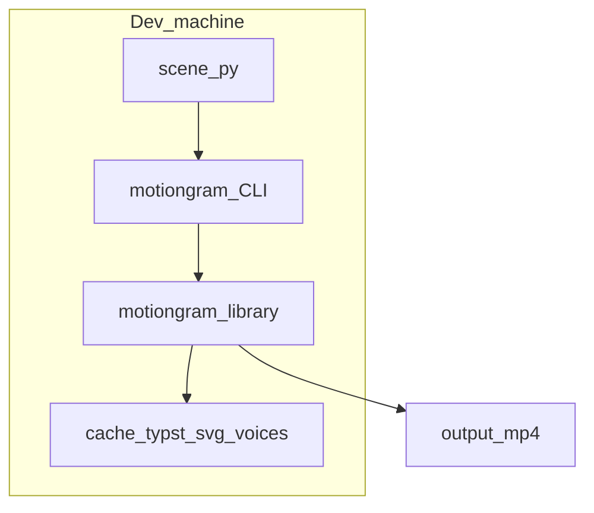
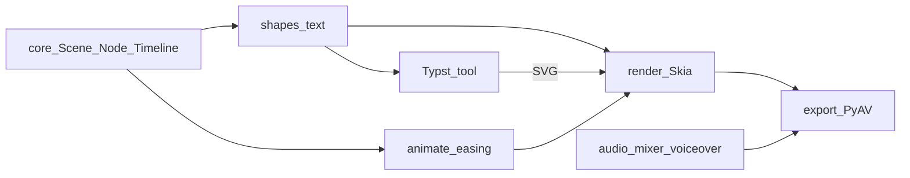

# Architecture (C4-style)

## Context (C4 Level 1)

Educators and tooling produce Python scene files. MotionGram reads them and writes MP4 (and optionally uses Kitten TTS models from the Hugging Face cache when the `tts` extra is installed).

## Containers (C4 Level 2)

- **CLI** — thin Typer wrapper: parse args, import scene, invoke pipeline.
- **Library** — scene graph, timeline, render, export, audio.
- **Cache** — disk cache under user home (XDG-style path TBD).

## Components (C4 Level 3)

## Key data flow

1. **Authoring time:** build `Scene`, attach `Node` tree, append `Timeline` entries.
2. **Render time:** for each `t`, evaluate active animators, update node state (implementation detail: mutable scratch state vs pure — TBD in implementation ADR).
3. **Encode time:** push RGB frames + PCM/WAV into PyAV muxer.

## Related documents

- [data-model.md](data-model.md)
- [rendering-pipeline.md](rendering-pipeline.md)
- [voiceover-adapter.md](voiceover-adapter.md)
