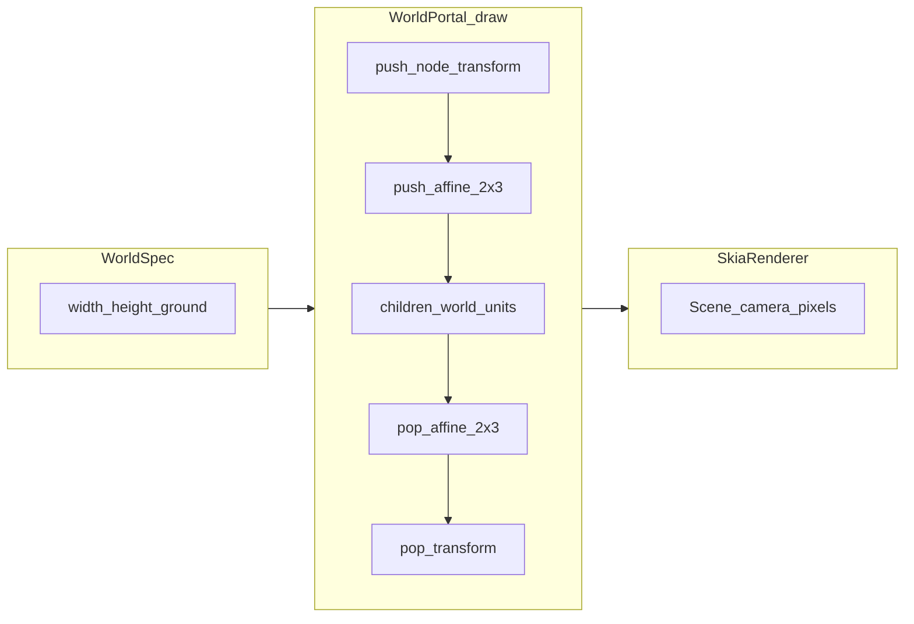

# World-building catalog (shapes + animation)

ManimLite scenes separate **structure** (`Node` graph), **time** (`Scene.add_animation`),
and **behavior** (`Animator` implementations). This page maps a few **drawing primitives**
and **motion combos** to the principle demos under [`examples/principles/`](principles/).

## Approach

This is the intended mental model for **world-authored** scenes (see [`world_building_plan.md`](../world_building_plan.md) for the full roadmap).

- **Coordinates:** World **x** spans `[-world_width/2, +world_width/2]`. World **y** uses `WorldSpec.y_down` (default: increasing downward). Vertical extent comes from `WorldSpec.world_height` if positive, else from **`default_world_height(world_width, frame_w, frame_h)`** so the mapped viewport matches the frame aspect ratio.
- **Order of transforms:** Anything under a **`WorldPortal`** is laid out in **world units**. The portal’s `draw` pushes an **affine** (`world_pixel_affine_coeffs` → `SkiaCanvas.push_affine_2x3`) so Skia sees **frame pixel** coordinates. **`Scene.camera`** (and `CameraPan` / `CameraZoom`) still run in **pixel space after** that—plan camera moves in pixels.
- **Semantic layers:** **`world_shell()`** returns named empty containers (`background`, `midground`, `foreground`, plus `props` / `characters` under mid). **Draw order follows tree order** (sibling order). **`Node.world_z`** is optional metadata only in v1; there is no global depth sort yet.
- **Ground:** (1) **Logical:** `WorldSpec.ground_y` plus **`place_on_ground(node, ground_y)`** for pinning a node’s anchor to the ground line. (2) **Visual:** optional **`ground_strip(spec, …)`** builds a full-width band under the portal whose **top edge** is at the chosen ground **y** (see [`principles/26_world_viewport.py`](principles/26_world_viewport.py)).
- **Procedural presets (optional):** **`manimlite.procedural`** hosts seedable manifests that materialize into a `world_shell()` and return handles for `add_animation` (see `RainyLandscapeManifest` in [`src/manimlite/procedural/`](../src/manimlite/procedural/__init__.py)). The root `manimlite` package does **not** re-export this subpackage.
- **Stubs:** `attach`, `mirror_x`, and `apply_gravity_step` remain unimplemented on purpose until bounds and graph-copy semantics are defined; clip motion stays on the **timeline** per [`AGENTS.md`](../AGENTS.md).



## World vs screen (logical units)

When you want **stage space** instead of guessing pixels:

- **`WorldSpec`** + **`WorldPortal`** — subtree `x` / `y` are **world units** with horizontal domain `[-world_width/2, +world_width/2]` (so with `world_width=10`, `x=-5` is the left edge). Skia still receives final pixel coordinates; the portal installs an affine map via `SkiaCanvas.push_affine_2x3`.
- **`Scene.camera`** / **`CameraPan`** / **`CameraZoom`** — still operate in **pixel** space **after** the portal (see [`SkiaRenderer.render_frame`](../src/manimlite/render.py)). Plan pans in pixels that match your composed layout.
- **`world_shell()`** — returns named empty containers (`background`, `midground`, `foreground`, `props`, `characters`) so you target intent, not coordinates; **painter order** follows tree order (no global depth sort yet).
- **`Node.world_z`** — optional metadata for recipes / documentation; v1 does not reorder drawing automatically.
- **Stubs** — `attach`, `mirror_x`, `apply_gravity_step` raise `NotImplementedError` until bounds and simulation hooks exist; **authored motion stays on the timeline** per [`AGENTS.md`](../AGENTS.md).

```python
from manimlite import Scene, SkiaRenderer, WorldPortal, WorldSpec, world_shell
from manimlite.core import Node
from manimlite.shapes import Ellipse

scene = Scene(width=960, height=540, fps=30, duration=1.0)
spec = WorldSpec(world_width=10.0, ground_y=-2.5)
portal = WorldPortal(spec=spec, frame_width=scene.width, frame_height=scene.height)
shell = world_shell()
portal.add(shell.world)
scene.add_node(portal)

mark = Node(x=0.0, y=0.0)  # world center
mark.add(Ellipse(rx=0.15, ry=0.15, fill_color="#F0C060"))
shell.midground.add(mark)
_ = SkiaRenderer().render_frame(scene, 0.0)
```

See [`principles/26_world_viewport.py`](principles/26_world_viewport.py) for a runnable static check.

## Drawing primitives → typical combinations

| Primitive | Combos | See |
|-----------|--------|-----|
| `Rectangle` | Panels, limbs, blocks | [`principles/02_shape.py`](principles/02_shape.py), [`principles/04_value.py`](principles/04_value.py) |
| `Ellipse` | Heads, bodies, wheels | [`recipes/animated_character.py`](recipes/animated_character.py) |
| `Polygon` | Hills, foliage, silhouettes | [`recipes/spatial_landscape.py`](recipes/spatial_landscape.py) |
| `Line` | Rings (segmented), stems, detail | [`showcase_intro.py`](../showcase_intro.py) (`_ring`) |
| `SemiCircle`, `Sector` | Eyes (domes), mouths, pie charts | [`principles/25_shape_sectors.py`](principles/25_shape_sectors.py), [`recipes/animated_character.py`](recipes/animated_character.py) |
| `Arc` | Strokes, gauges | [`principles/19_arcs.py`](principles/19_arcs.py) (path motion; arc stroke) |

Compose under a parent `Node` so the whole prop moves as one rig; child coordinates are **local**
to the parent anchor.

## Animator combinators → typical moods

| Pattern | Effect | See |
|---------|--------|-----|
| `Parallel(A, B)` | Same segment, multiple DOFs | [`principles/13_squash_stretch.py`](principles/13_squash_stretch.py), [`showcase_intro.py`](../showcase_intro.py) |
| `Sequence(...)` | Phases on one target | [`principles/16_straight_pose.py`](principles/16_straight_pose.py) |
| `Delay(inner, a, b)` | Gate inside normalized segment | [`AGENTS.md`](../AGENTS.md) |
| `MoveArc` | Weight along an arc | [`principles/19_arcs.py`](principles/19_arcs.py) |
| `TimeScale` / custom ease | Spacing without new animator | [`principles/18_slow_in_out.py`](principles/18_slow_in_out.py) |

## Reusable timeline snippets

| Helper | Role | Defined in |
|--------|------|------------|
| `add_squash_stretch_drop` | Parallel squash–stretch + vertical move | [`manimlite.recipes`](../src/manimlite/recipes.py) |
| `add_blink` | Two-phase `ScaleY` on wrapper nodes | [`manimlite.recipes`](../src/manimlite/recipes.py) |

Worked examples: [`recipes/animated_character.py`](recipes/animated_character.py).

## Starter recipes

- **Spatial only:** [`recipes/spatial_landscape.py`](recipes/spatial_landscape.py)
- **Spatial + clips:** [`recipes/animated_character.py`](recipes/animated_character.py)

Authoring rules remain those in [`AGENTS.md`](../AGENTS.md): keep motion on the timeline, not inside `Node.update`, for deterministic clips.
