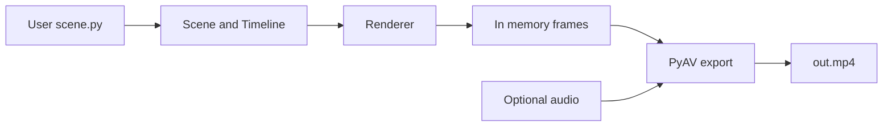

# Phase 100 — Final architecture

## Goal of this phase

Close the loop: a **coherent** system description matching the `manimlite` package layout and the constraints from Phase 000.

## Problem being solved

You should leave with one mental model that maps 1:1 to directories you will edit.

## Implementation

**Modules (roughly):**

- `manimlite.core` — `Scene`, `Node`, `Timeline`, `Drawable`
- `manimlite.shapes` — `Circle`, `Line`, `Rect`…
- `manimlite.text` — `Text`, `MathExpr` (Typst), `CodeBlock` (Pygments)
- `manimlite.animate` — animators, easing
- `manimlite.render` — Skia (prod) / numpy (debug)
- `manimlite.export` — PyAV in-process
- `manimlite.audio` — mix + TTS adapter(s)
- `manimlite.cli` — user entrypoint

**Data path:**

## Explanation

**Flat public API** + **deep internals** (Skia, libav) is the right split. Keep the user-facing object graph boring; put complexity behind protocols with one implementation each at first.

## Limitations

Everything here remains **staged** until the implementation work lands; see [roadmap.md](../docs/roadmap.md) for real milestones.

## Next phase preview

**Done.** Re-read [README](README.md) for the index, then open `src/manimlite/` and align your experiments with the repo’s types and ADRs in [`docs/design/adr/`](../docs/design/adr/).
